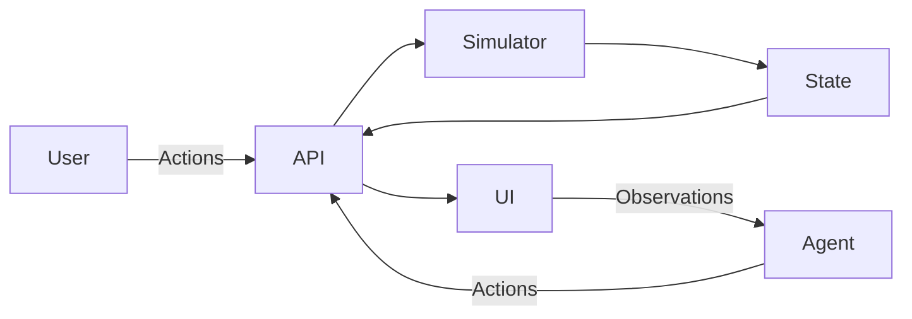
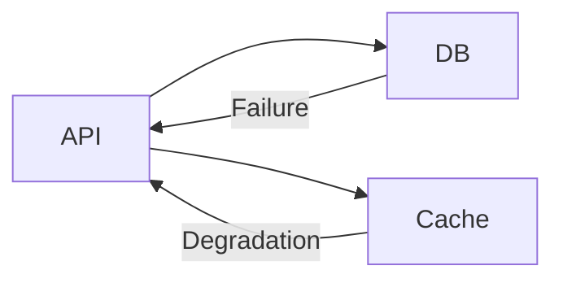
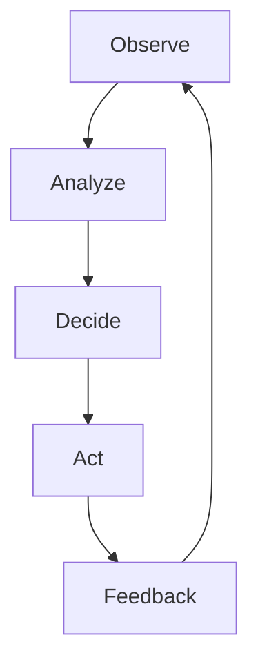

# 🚀 OpenEnv SRE Simulator

### 🧠 AI-Powered DevOps Incident Response Environment

<p align="center">
  <b>Train AI agents to act like real-world SRE engineers</b><br/>
  Diagnose failures → Take actions → Stabilize systems
</p>

---

# 🌍 🔥 What This Is

A **realistic simulation of production system failures** where an AI agent must:

```text
🔍 Analyze logs + metrics + alerts
🧠 Reason about system failures
⚡ Take corrective actions
✅ Recover the system efficiently
```

---

# 🧩 🏗️ System Architecture



---

# ⚙️ 🖥️ Distributed System Model



---

# 🔥 ⚠️ Cascading Failures (REALISTIC!)

```text
DB Down ❌ → Latency ↑ → API Errors ↑ → System Degrades 🔴
High CPU ⚠️ → Slow Processing → Increased Latency
Dirty Cache 🟡 → Repeated DB hits → Performance drop
```

---

# 🎮 🧠 What the Agent Sees

```json
{
  "metrics": {
    "cpu": 92.5,
    "latency": 520
  },
  "logs": [
    "[ERROR] Database connection timeout",
    "[ERROR] API latency critical"
  ],
  "alerts": ["Database connection failure", "High latency"]
}
```

---

# 🎯 🧪 Tasks (Difficulty Progression)

## 🟢 Easy — Cache Optimization

```text
Problem: High latency due to cache inefficiency
Goal: Clear cache → reduce latency
```

---

## 🟡 Medium — Database Recovery

```text
Problem: Database connection failure
Goal: Restore DB → stabilize system
```

---

## 🔴 Hard — Full System Outage

```text
Problems:
❌ DB Down
⚠ High CPU
⚠ High Latency

Goal:
✔ Fix DB
✔ Scale services
✔ Clear cache
✔ Restart services
```

---

# ⚡ 🎯 Action Space

```json
{
  "clear_cache": "Reduce latency",
  "fix_db_connection": "Restore database",
  "scale_service": "Reduce CPU load",
  "restart_service": "Recover failed service",
  "noop": "Do nothing"
}
```

---

# 📊 🏆 Reward Design (SMART)

```text
+1.0  → Full system recovery
+0.5  → Major fix (DB recovery)
+0.3  → Partial improvement
-0.1  → Inefficient action
```

✔ Dense feedback
✔ Encourages optimal sequences
✔ Penalizes bad decisions

---

# 🤖 🧠 AI Agent Behavior



---

# 📈 📊 Baseline Results

```text
[START] task=easy_cache
→ clear_cache → SUCCESS (1 step)

[START] task=medium_db
→ fix_db_connection → SUCCESS (1 step)

[START] task=hard_outage
→ fix_db → scale → scale → clear_cache → SUCCESS (4 steps)
```

---

## 🏆 Performance Table

| Task   | Steps | Score |
| ------ | ----- | ----- |
| Easy   | 1     | 1.00  |
| Medium | 1     | 1.00  |
| Hard   | 4     | 0.90+ |

---

# 🖥️ 🎨 Frontend UI (🔥 WOW FACTOR)

### Live Dashboard Includes:

- 📊 Metrics (CPU, latency)
- 📜 Logs (real-time system logs)
- 🚨 Alerts (critical issues)
- 🧩 System Diagram (API → DB → Cache)
- 🧠 AI Explanation (why action was taken)
- 📈 Action Timeline

---

# 🧠 💡 Why This Is Powerful

✔ Real-world system modeling
✔ Cascading failures
✔ Interactive UI
✔ AI reasoning + explainability
✔ OpenEnv compliant

👉 Not a toy — a **real training environment**

---

# 🐳 ⚙️ Installation

```bash
git clone <repo>
cd openenv-sre
pip install -r requirements.txt
```

---

# ▶️ Run Backend

```bash
uvicorn server.app:app --host 0.0.0.0 --port 7860
```

---

# 🤖 Run Agent

```bash
python inference.py
```

---

# 🐳 Docker

```bash
docker build -t openenv-sre .
docker run -p 7860:7860 openenv-sre
```

---

# 🌐 Hugging Face Deployment

Set environment variables:

```text
API_BASE_URL=http://localhost:7860
MODEL_NAME=gpt-4o-mini
HF_TOKEN=<your-token>
```

---

# 🚀 Future Work

- 🌐 Network failure simulation
- 🧠 Reinforcement learning agents
- 🧩 Multi-service scaling policies
- 📉 Memory leak detection

---

# 🏁 Conclusion

This project demonstrates how AI agents can:

👉 Understand complex system failures
👉 Take intelligent actions
👉 Recover systems autonomously

🔥 A step toward **autonomous DevOps AI systems**

---

<p align="center">
  ⭐ Built for OpenEnv Hackathon  
  💡 Powered by AI + Real Systems Thinking  
</p>
